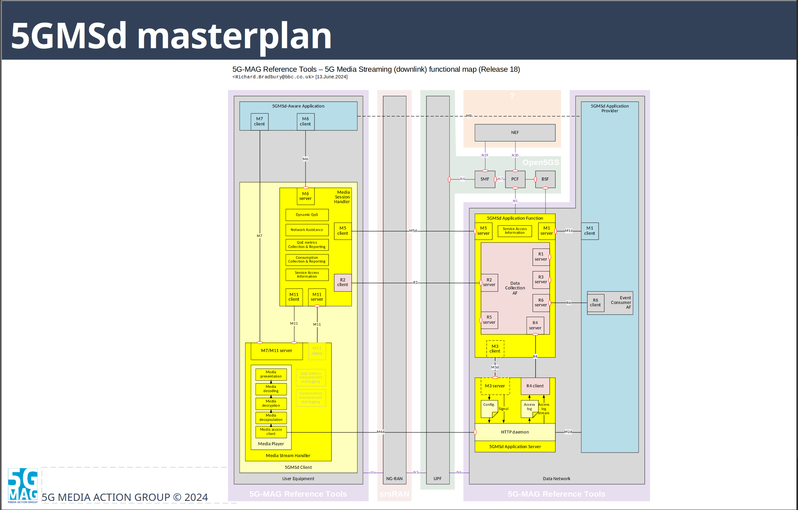
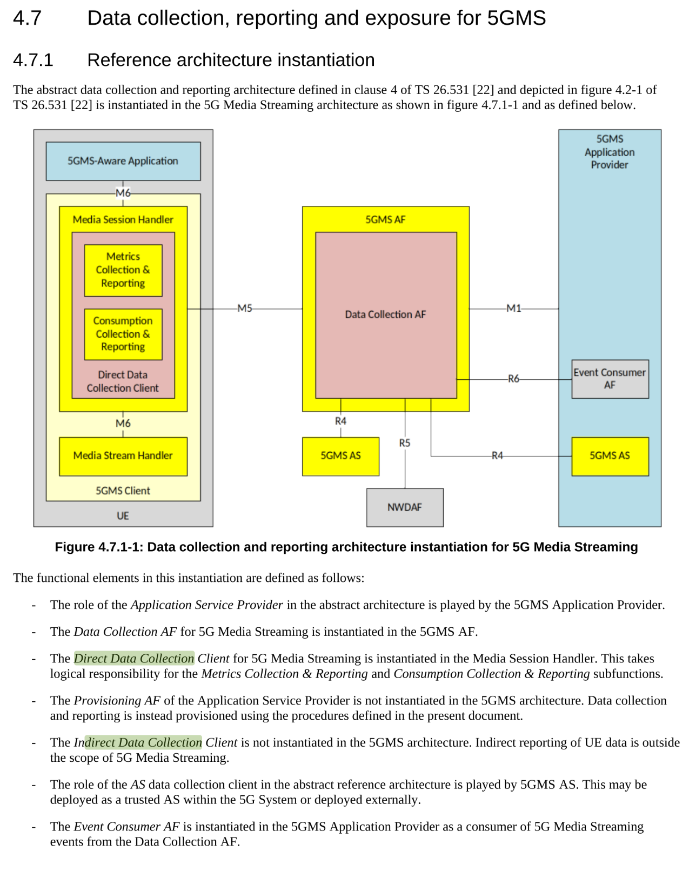

# Integration plan

## v1.17.10 4.7.1 Reference architecture instantiation

**R1** 
R1 This reference point is not instantiated in the 5GMS architecture.

**M1** 
M1 Provisioning of data collection and reporting features in the Data Collection AF.

**R2** 
R2 This reference point is not instantiated in the 5GMS architecture. Instead, it is logically realised by the
combination of the following components:

- Internal interfaces between the Direct Data Reporting Client and its subordinate functions, namely Metrics
Collection & Reporting and Consumption Reporting & Reporting.
- Internal interface between the Media Session Handler and its subordinate Direct Data Collection Client
function.
- Reference point M5, as defined below.
- Internal interface between the 5GMS AF and its subordinate Data Collection AF function.

**M5** 
M5 Direct data reporting by the Direct Data Collection Client to the Data Collection AF, via the Media Session
Handler and 5GMS AF.

**R3** 
R3 This reference point is not instantiated in the 5GMS architecture.

**R4** 
R4 Media streaming access reporting by the 5GMS AS to the Data Collection AF.

**R5** 
R5 Event exposure by the Data Collection AF to subscribing NWDAF [23] instances.

**R6** 
R6 Event exposure by the Data Collection AF to subscribing Event Consumer AF instances in the 5GMS
Application Provider.

**R7** 
R7 This reference point is not instantiated in the 5GMS architecture.

**M6** 
M6 Configuration of 5GMS-related data reporting by the 5GMS-Aware Application.

**R8** 
R8 This reference point is not instantiated in the 5GMS architecture.

## whats has to be implemented
**Media Session Handler**  
- R2 client in the Media Session Handler (UE) is missing, BUT R2 is not instantiated in the 5GMS architecture v1.17.10 (Richard has R2 in the diagram, but for release 18)

- R2 is also not in the 5GMS architecture diagram in v1.17.10:

**5GMS AS**  
- R4 client on side of the 5GMS AS, musst be implemented.

**5GMS Application Provider**  
- R6 client is missing in the 5GMS Application Provider, and needed to be implemented.

**5GMS Application Function**  
- new m5 handling all reports to the DCAF
- 2 modes ?
- integrate libary and give the R intfaces ip adresses

## Questions

1. Would there be two modes of running the 5GMS AF, one with the DCAF involved and one without or is it always expected to operate with the DCAF and we do not need to consider the mode without the DCAF?
2. How should M5 reporting be integrated when the DCAF is used by the 5GMS AF? Should the 5GMS AF forward each M5 report to the DCAF, and if so, how must the M5 data be mapped to the DCAF R2, R3, or R4 interface? Does the DCAF expose an internal interface corresponding to M5, or must the 5GMS AF convert the M5 reports into the appropriate DCAF data reporting format? Which reports belong to which interface?
3. The R6 client is inside the Event Consumer AF in the 5GMS Application Provider, how can i understand his is a Application Function running inside the 5GMS Application Provider?
4. AF is on version v1.7.10 so r2 should not be instantiated in the 5GMS architecture?